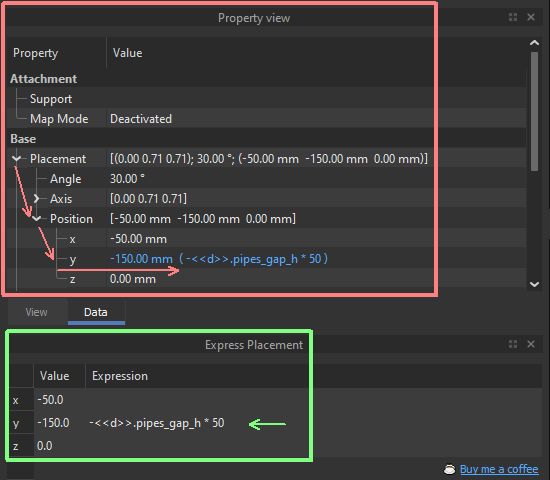

# FreeCAD Express Placement
Express Placement is a FreeCAD GUI addon. It allows quick editing of X, Y, Z coordinates of the selected object. 

I have tested this addon on a lot of my FreeCAD files with different levels of complexity. It works fine in all of them. However, I cannot foresee all cases that may break down the simple straightforward logic of this add-on. So, if you encounter any problems, please let me know so I can fix them.

 

# Let's see the difference and benefits

## Standard FreeCAD Placement (in red)

The standard FreeCAD built-in editor requires many additional mouse clicks before you actually start parameter editing, especially when using parametric expressions to position your object:

1. Click on the Base/Placement item in the Property view to __unfold the Placement tree__.
2. Click on the Position branch to __unfold the X, Y, Z coordinates fields__.
3. Click on the desired coordinate to __make the expression editing icon visible__.
4. Click the __expression editing icon__, which is so small that it may be a _challenge to hit it_. Alternatively, __press the "=" key__ on the keyboard. This may take even longer than clicking the icon.

You must repeat these clicks when you select another object. Again and again...

## Express Placement (in green)

The __Express Placement__ macro creates a __special panel__ for you. You may dock this panel to any suitable place. It shows __three rows with X, Y, Z coordinates__. These coordinates contain values and expression fields. They are __available for editing with just one double click__.

 

One double click to edit object placement instead of four sequential clicks! 
__You may work 4 times faster__!

 

# Direct Launch of Express Placement
You may download and use Express Placement addon immediately in your FreeCAD:

1. Download the _fc-express-placement.FCMacro_ file and place it in the _User Macros_ folder inside your FreeCAD installation folder.
2. _Execute_ it directly from the FreeCAD _main menu Macro / Macros / User Macros_.

 

# Installing Express Placement Toolbar Button
To have an ability to quickly switch on Express Placement table, you may place a button to quickly exwcute this macro and bring up Express Placement table:

1. Download the _fc-express-placement.FCMacro_ file and place it in the _User Macros_ folder inside your FreeCAD installation folder.
2. _Select_ the Express Placement macro in the _User Macros_ panel, invoked from the FreeCAD _main menu Macro / Macros / User Macros_.
3. Press the _Toolbar_ button and follow the Walkthrough dialog to place the Express Placement button in the desired location in the FreeCAD toolbars.

 

---

_If you find this add-on useful and feel it's worth treating me to a couple-triple coffee cups in recognition of my work, at any time you may do it via_ [&#x2615; Buy me a coffee](https://www.buymeacoffee.com/screeneroner)